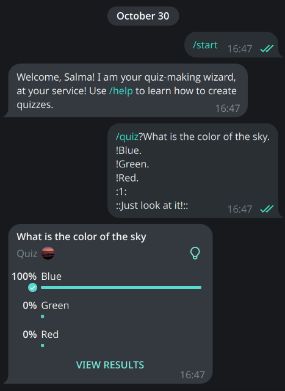

# Quizz_ybot

A Telegram bot written in Python using the `python-telegram-bot` package.

**Preview:**

## Features

1. **Create a Quiz from a Single Message**:
   - Send a formatted message containing the question, answers, correct answer ID, and optional explanation.
   - The bot will automatically convert it into a quiz and share it in the chat.

2. **Step-by-Step Quiz Creation**:
   - Create a quiz interactively by following the bot's instructions, sending each component (question, answers, etc.) as separate messages.

## How to Use the Bot

### Display Instructions
Send the `/help` command to display detailed instructions for using the bot.

### Create a Quiz from a Single Message
Format your message as follows:
- **Question**: Surround the question with a question mark (`?`) and a dot (`.`).  
  Example: `?What is the color of the sky.`

- **Answers**: Surround each answer with an exclamation mark (`!`) and a dot (`.`).  
  Example: `!Blue.` `!Green.` `!Red.`

- **Correct Answer ID**: Specify the correct answer index (starting from 1), surrounded by colons (`:`).  
  Example: `:1:`

- **Explanation (Optional)**: Add an explanation surrounded by double colons (`::`).  
  Example: `::Because the sky reflects sunlight!::`

**Example Command**:
<pre>
/quiz 
?What is the color of the sky. 
!Blue. 
!Green. 
!Red. 
:1: 
::Just look at it!::
</pre>

### Step-by-Step Quiz Creation
1. Send `/lquiz` to start the process.
2. Follow the bot's prompts:
   - Send the **question**.
   - Send the **answers** (one per message). Type `done` when finished.
   - Send the **correct answer number**.
   - Optionally, send an **explanation** or type `done` to skip.
3. The bot will create and share the quiz in the chat.

## Vision

**Quizz_ybot** aims to simplify quiz creation on Telegram, making it effortless for teachers, students, and anyone who wants to create engaging, interactive quizzes. By reducing the need for repetitive manual inputs, the bot streamlines the process, saving time and effort for its users

## Feedback

Nothing is ever perfect and suitable for everyone! Please send me your feedback through email.

